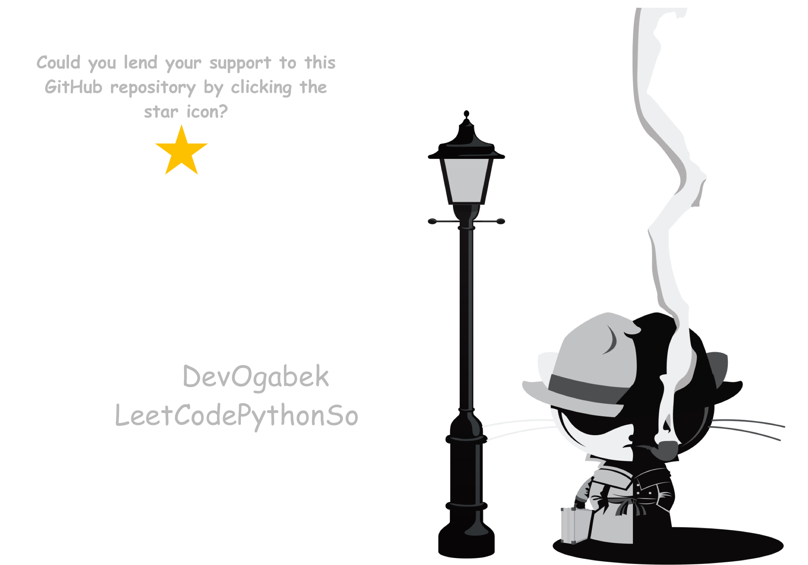

# LeetCode Python Solutions

Welcome to my LeetCode Python Solutions repository! Here, you'll find my solutions to various LeetCode problems implemented in Python.

## About

I'm dedicated to solving LeetCode problems using the Python programming language. This repository serves as a collection of my solutions, providing a reference for others and showcasing my problem-solving skills.

## Folder Structure

- Each problem solution is organized in its dedicated folder.
- The folder name corresponds to the problem's title. 
- Inside each folder, you'll find the Python script containing the solution.

## How to Navigate

Feel free to explore the folders to find solutions to specific problems. Each Python script is thoroughly commented to explain the thought process and approach used to solve the problem.

## License

This project is licensed under the MIT License - see the [LICENSE](LICENSE) file for details.

## My LeetCode stats

## Solved Problems

- [Concatenation of Array](Python/concatenation_of_array.py)
- [Build Array from Permutation](Python/build_array_from_permutation.py)
- [Number of Good Pairs](Python/number_of_good_pairs.py)
- [Final Value of Variable After Performing Operations](Python/final_value_of_variable_after_performing_operations.py)
- [Shuffle the Array](Python/shuffle_the_array.py)
- [Find Words Containing Character](Python/find_words_containing_character.py)
- [Widest Vertical Area Between Two Points Containing No Points](Python/widest_vertical_area_between_two_points_containing_no_points.py)
- [Richest Customer Wealth](Python/richest_customer_wealth.py)
- [Kids With the Greatest Number of Candies](Python/kids_with_the_greatest_number_of_candies.py)
- [Number of Employees Who Met the Target](Python/number_of_employees_who_met_the_target.py)
- [Count Pairs Whose Sum is Less than Target](Python/count_pairs_whose_sum_is_less_than_target.py)
- [Running Sum of 1d Array](Python/running_sum_of_1d_array.py)
- [How Many Numbers Are Smaller Than the Current Number](Python/how_many_numbers_are_smaller_than_the_current_number.py)
- [Maximum Number of Words Found in Sentences](Python/maximum_number_of_words_found_in_sentences.py)
- [Sum of Values at Indices With K Set Bits](Python/sum_of_values_at_indices_with_k_set_bits.py)
- [Decode XORed Array](Python/decode_xored_array.py)
- [Left and Right Sum Differences](Python/left_and_right_sum_differences.py)
- [Minimum Number Game](Python/minimum_number_game.py)
- [Create Target Array in the Given Order](Python/create_target_array_in_the_given_order.py)
- [Decompress Run-Length Encoded List](Python/decompress_run-length_encoded_list.py)
- [Check If Two String Arrays are Equivalent](Python/check_if_two_string_arrays_are_equivalent.py)
- [Count Items Matching a Rule](Python/count_items_matching_a_rule.py)
- [Shuffle String](Python/shuffle_string.py)
- [Truncate Sentence](Python/truncate_sentence.py)
- [Find First Palindromic String in the Array](Python/find_first_palindromic_string_in_the_array.py)
- [Difference Between Element Sum and Digit Sum of an Array](Python/difference_between_element_sum_and_digit_sum_of_an_array.py)
- [Number of Arithmetic Triplets](Python/number_of_arithmetic_triplets.py)
- [Count Number of Pairs With Absolute Difference K](Python/count_number_of_pairs_with_absolute_difference_k.py)
- [Sum of All Odd Length Subarrays](Python/sum_of_all_odd_length_subarrays.py)
- [Count the Number of Consistent Strings](Python/count_the_number_of_consistent_strings.py)
- [Defanging an IP Address](Python/defanging_an_ip_address.py)
- [Find All People With Secret](Python/find_all_people_with_secret.py)
- [Jewels and Stones](Python/jewels_and_stones.py)
- [Cheapest Flights Within K Stops](Python/cheapest_flights_within_k_stops.py)
- [Find the Town Judge](Python/find_the_town_judge.py)
- [Greatest Common Divisor Traversal](Python/greatest_common_divisor_traversal.py)
- [Largest Local Values in a Matrix](Python/largest_local_values_in_a_matrix.py)
- [Find the Highest Altitude](Python/find_the_highest_altitude.py)
- [Check if a String Is an Acronym of Words](Python/check_if_a_string_is_an_acronym_of_words.py)
- [Maximum Product Difference Between Two Pairs](Python/maximum_product_difference_between_two_pairs.py)
- [Diameter of Binary Tree](Python/diameter_of_binary_tree.py)
- [Two Sum](Python/two_sum.py)
- [Find Bottom Left Tree Value](Python/find_bottom_left_tree_value.py)
- [Sort the People](Python/sort_the_people.py)
- [Palindrome Number](Python/palindrome_number.py)
- [Matrix Diagonal Sum](Python/matrix_diagonal_sum.py)
- [Same Tree](Python/same_tree.py)
- [To Lower Case](Python/to_lower_case.py)
- [Subarrays Distinct Element Sum of Squares I](Python/subarrays_distinct_element_sum_of_squares_i.py)
- [Sum of All Subset XOR Totals](Python/sum_of_all_subset_xor_totals.py)
- [Even Odd Tree](Python/even_odd_tree.py)
- [Count Good Triplets](Python/count_good_triplets.py)
- [Flipping an Image](Python/flipping_an_image.py)
- [Maximum Odd Binary Number](Python/maximum_odd_binary_number.py)
- [Count Tested Devices After Test Operations](Python/count_tested_devices_after_test_operations.py)
- [Squares of a Sorted Array](Python/squares_of_a_sorted_array.py)
- [Sum of Squares of Special Elements ](Python/sum_of_squares_of_special_elements_.py)
- [Remove Nth Node From End of List](Python/remove_nth_node_from_end_of_list.py)
- [Count Equal and Divisible Pairs in an Array](Python/count_equal_and_divisible_pairs_in_an_array.py)
- [Find Maximum Number of String Pairs](Python/find_maximum_number_of_string_pairs.py)
- [Separate the Digits in an Array](Python/separate_the_digits_in_an_array.py)
- [Roman to Integer](Python/roman_to_integer.py)
- [DI String Match](Python/di_string_match.py)
- [Find the Difference of Two Arrays](Python/find_the_difference_of_two_arrays.py)
- [Find Maximum Number of String Pairs](Python/find_maximum_number_of_string_pairs.py)
- [Array Partition](Python/array_partition.py)
- [Bag of Tokens](Python/bag_of_tokens.py)
- [Goal Parser Interpretation](Python/goal_parser_interpretation.py)
- [Maximum Sum With Exactly K Elements ](Python/maximum_sum_with_exactly_k_elements_.py)
- [Remove Palindromic Subsequences](Python/remove_palindromic_subsequences.py)
- [Design an Ordered Stream](Python/design_an_ordered_stream.py)
- [Maximum Product Difference Between Two Pairs](Python/maximum_product_difference_between_two_pairs.py)
- [Minimum Number of Moves to Seat Everyone](Python/minimum_number_of_moves_to_seat_everyone.py)
- [Find Common Elements Between Two Arrays](Python/find_common_elements_between_two_arrays.py)
- [Minimum Operations to Exceed Threshold Value I](Python/minimum_operations_to_exceed_threshold_value_i.py)
- [Cells with Odd Values in a Matrix](Python/cells_with_odd_values_in_a_matrix.py)
- [Sort Integers by The Number of 1 Bits](Python/sort_integers_by_the_number_of_1_bits.py)
- [Counting Words With a Given Prefix](Python/counting_words_with_a_given_prefix.py)
- [Delete Greatest Value in Each Row](Python/delete_greatest_value_in_each_row.py)
- [Find Greatest Common Divisor of Array](Python/find_greatest_common_divisor_of_array.py)
- [Final Prices With a Special Discount in a Shop](Python/final_prices_with_a_special_discount_in_a_shop.py)
- [Count Negative Numbers in a Sorted Matrix](Python/count_negative_numbers_in_a_sorted_matrix.py)
- [Find Numbers with Even Number of Digits](Python/find_numbers_with_even_number_of_digits.py)
- [Sum of Unique Elements](Python/sum_of_unique_elements.py)
- [Unique Number of Occurrences](Python/unique_number_of_occurrences.py)
- [Neither Minimum nor Maximum](Python/neither_minimum_nor_maximum.py)
- [N-Repeated Element in Size 2N Array](Python/n-repeated_element_in_size_2n_array.py)
- [Height Checker](Python/height_checker.py)
- [Find the Peaks](Python/find_the_peaks.py)
- [Sort Array By Parity](Python/sort_array_by_parity.py)
- [Sort Array By Parity](Python/sort_array_by_parity.py)
- [Number of Senior Citizens](Python/number_of_senior_citizens.py)
- [Find Target Indices After Sorting Array](Python/find_target_indices_after_sorting_array.py)
- [Points That Intersect With Cars](Python/points_that_intersect_with_cars.py)
- [Baseball Game](Python/baseball_game.py)
- [Minimum Length of String After Deleting Similar Ends](Python/minimum_length_of_string_after_deleting_similar_ends.py)
- [Decode the Message](Python/decode_the_message.py)
- [Find N Unique Integers Sum up to Zero](Python/find_n_unique_integers_sum_up_to_zero.py)
- [Minimum Operations to Make the Array Increasing](Python/minimum_operations_to_make_the_array_increasing.py)
- [Replace All Digits with Characters](Python/replace_all_digits_with_characters.py)
- [Sorting the Sentence](Python/sorting_the_sentence.py)
- [Split a String in Balanced Strings](Python/split_a_string_in_balanced_strings.py)
- [Number of Students Doing Homework at a Given Time](Python/number_of_students_doing_homework_at_a_given_time.py)
- [Ant on the Boundary](Python/ant_on_the_boundary.py)
- [Middle of the Linked List](Python/middle_of_the_linked_list.py)
- [Split Strings by Separator](Python/split_strings_by_separator.py)
- [Count Elements With Maximum Frequency](Python/count_elements_with_maximum_frequency.py)
- [Maximum Strong Pair XOR I](Python/maximum_strong_pair_xor_i.py)
- [Minimum Common Value](Python/minimum_common_value.py)
- [Letter Combinations of a Phone Number](Python/letter_combinations_of_a_phone_number.py)
- [Generate Parentheses](Python/generate_parentheses.py)
- [Symmetric Tree](Python/symmetric_tree.py)
- [Combination Sum](Python/combination_sum.py)
- [Longest Common Prefix](Python/longest_common_prefix.py)
- [Intersection of Two Arrays](Python/intersection_of_two_arrays.py)
- [Permutations](Python/permutations.py)
- [Merge Similar Items](Python/merge_similar_items.py)
- [Maximum Number of Pairs in Array](Python/maximum_number_of_pairs_in_array.py)
- [Maximum Units on a Truck](Python/maximum_units_on_a_truck.py)
- [Merge Sorted Array](Python/merge_sorted_array.py)
- [Best Time to Buy and Sell Stock](Python/best_time_to_buy_and_sell_stock.py)
- [Majority Element](Python/majority_element.py)
- [Transpose Matrix](Python/transpose_matrix.py)
- [Remove Zero Sum Consecutive Nodes from Linked List](Python/remove_zero_sum_consecutive_nodes_from_linked_list.py)
- [N-Queens](Python/n-queens.py)
- [Subsets](Python/subsets.py)
- [Binary Tree Inorder Traversal](Python/binary_tree_inorder_traversal.py)
- [Single Number](Python/single_number.py)
- [Move Zeroes](Python/move_zeroes.py)
- [Convert Sorted Array to Binary Search Tree](Python/convert_sorted_array_to_binary_search_tree.py)
- [Pascal's Triangle](Python/pascals_triangle.py)
- [Find the Pivot Integer](Python/find_the_pivot_integer.py)
- [Find the Index of the First Occurrence in a String](Python/find_the_index_of_the_first_occurrence_in_a_string.py)
- [Binary Subarrays With Sum](Python/binary_subarrays_with_sum.py)
- [Valid Palindrome](Python/valid_palindrome.py)
- [Is Subsequence](Python/is_subsequence.py)
- [Climbing Stairs](Python/climbing_stairs.py)
- [Reverse Linked List](Python/reverse_linked_list.py)
- [Merge Two Sorted Lists](Python/merge_two_sorted_lists.py)
- [Modify the Matrix](Python/modify_the_matrix.py)
- [Next Greater Element I](Python/next_greater_element_i.py)
- [Binary Subarrays With Sumvv](Python/binary_subarrays_with_sumvv.py)
- [Maximum Depth of Binary Tree](Python/maximum_depth_of_binary_tree.py)
- [Product of Array Except Self](Python/product_of_array_except_self.py)
- [Contiguous Array](Python/contiguous_array.py)
- [Destination City](Python/destination_city.py)
- [Split Strings by Separator](Python/split_strings_by_separator.py)
- [Make Array Zero by Subtracting Equal Amounts](Python/make_array_zero_by_subtracting_equal_amounts.py)
- [Most Common Word](Python/most_common_word.py)
- [Insert Interval](Python/insert_interval.py)
- [Valid Anagram](Python/valid_anagram.py)
- [Word Search](Python/word_search.py)
- [Number of Students Unable to Eat Lunch](Python/number_of_students_unable_to_eat_lunch.py)
- [Check if the Sentence Is Pangram](Python/check_if_the_sentence_is_pangram.py)
- [Rings and Rods](Python/rings_and_rods.py)
- [Two Out of Three](Python/two_out_of_three.py)
- [Check if All Characters Have Equal Number of Occurrences](Python/check_if_all_characters_have_equal_number_of_occurrences.py)
- [Find the Distinct Difference Array](Python/find_the_distinct_difference_array.py)
- [First Letter to Appear Twice](Python/first_letter_to_appear_twice.py)
- [Ransom Note](Python/ransom_note.py)
- [Contains Duplicate II](Python/contains_duplicate_ii.py)
- [Existence of a Substring in a String and Its Reverse](Python/existence_of_a_substring_in_a_string_and_its_reverse.py)
- [Count Substrings Starting and Ending with Given Character](Python/count_substrings_starting_and_ending_with_given_character.py)
- [Minimum Deletions to Make String K-Special](Python/minimum_deletions_to_make_string_k-special.py)
- [Merge In Between Linked Lists](Python/merge_in_between_linked_lists.py)
- [Find Missing and Repeated Values](Python/find_missing_and_repeated_values.py)
- [Reverse Words in a String III](Python/reverse_words_in_a_string_iii.py)
- [Cells in a Range on an Excel Sheet](Python/cells_in_a_range_on_an_excel_sheet.py)
- [Row With Maximum Ones](Python/row_with_maximum_ones.py)
- [Find the K-or of an Array](Python/find_the_k-or_of_an_array.py)
- [Count Prefixes of a Given String](Python/count_prefixes_of_a_given_string.py)
- [Find Champion I](Python/find_champion_i.py)
- [Find Champion I](Python/find_champion_i.py)